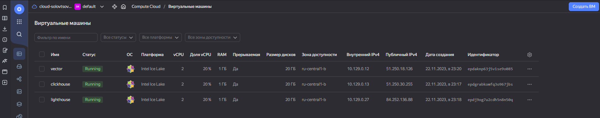
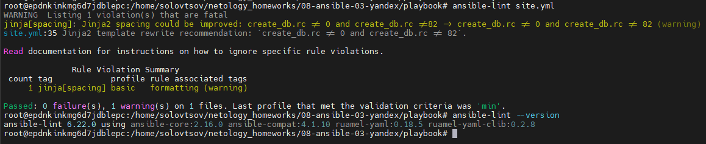

# Домашнее задание к занятию 3 «Использование Ansible»

## Подготовка к выполнению

1. Подготовьте в Yandex Cloud три хоста: для `clickhouse`, для `vector` и для `lighthouse`.  
Ответ:


2. Репозиторий LightHouse находится [по ссылке](https://github.com/VKCOM/lighthouse).

## Основная часть

1. Допишите playbook: нужно сделать ещё один play, который устанавливает и настраивает LightHouse.  
Ответ:
```
- name: Install Nginx
  hosts: lighthouse
  handlers:
    - name: Start Nginx service
      become: true
      ansible.builtin.service:
        name: nginx
        state: restarted
  tasks:
    - name: Instal epel-release
      become: true
      ansible.builtin.yum:
        name: epel-release
        state: present
    - name: Install nginx
      become: true
      ansible.builtin.yum:
        name: nginx
        state: present
    - name: Configure nginx
      become: true
      template:
        src: templates/nginx.j2
        dest: /etc/nginx/nginx.conf
        mode: 0644
      notify: Start Nginx service

- name: Install Lighthouse
  hosts: lighthouse
  handlers:
    - name: Restart Nginx
      become: true
      ansible.builtin.service:
        name: nginx
        state: restarted
  pre_tasks:
    - name: Install Git
      become: true
      ansible.builtin.yum:
        name: git
        state: present
  tasks:
    - name: Install Lighthouse
      become: true
      git:
        repo: https://github.com/VKCOM/lighthouse.git
        version: master
        dest: /etc/lighthouse
    - name: Configuring Lighthouse
      become: true
      template:
        src: templates/lighthouse.j2
        dest: /etc/nginx/conf.d/default.conf
        mode: 0644
      notify: Restart Nginx
```
2. При создании tasks рекомендую использовать модули: `get_url`, `template`, `yum`, `apt`.  
3. Tasks должны: скачать статику LightHouse, установить Nginx или любой другой веб-сервер, настроить его конфиг для открытия LightHouse, запустить веб-сервер.
4. Подготовьте свой inventory-файл `prod.yml`.  
Ответ:
```
---
clickhouse:
  hosts:
    clickhouse-01:
      ansible_host: 51.250.30.255
      ansible_user: solovtsov

vector:
  hosts:
    vector-01:
      ansible_host: 51.250.18.126
      ansible_user: solovtsov

lighthouse:
  hosts:
    lighthouse-01:
      ansible_host: 84.252.136.88
      ansible_user: solovtsov
```
5. Запустите `ansible-lint site.yml` и исправьте ошибки, если они есть.  
Ответ: Установил свежий Debian, python и ansible с ansible-lint, исправил ошибки, сейчас `ansible-lint site.yml` ошибок не показывет.  

6. Попробуйте запустить playbook на этом окружении с флагом `--check`.
```
root@my-server:/home/solovtsov/homework/netology_homeworks/08-ansible-03-yandex/playbook# ansible-playbook -i inventory/prod.yml site.yml --check

PLAY [Install Clickhouse] ***************************************************************************************************************************************************************************

TASK [Gathering Facts] ******************************************************************************************************************************************************************************
ok: [clickhouse-01]

TASK [Get clickhouse distrib] ***********************************************************************************************************************************************************************
ok: [clickhouse-01] => (item=clickhouse-client)
ok: [clickhouse-01] => (item=clickhouse-server)
failed: [clickhouse-01] (item=clickhouse-common-static) => {"ansible_loop_var": "item", "changed": false, "dest": "./clickhouse-common-static-22.3.3.44.rpm", "elapsed": 0, "gid": 1000, "group": "solovtsov", "item": "clickhouse-common-static", "mode": "0664", "msg": "Request failed", "owner": "solovtsov", "response": "HTTP Error 404: Not Found", "secontext": "unconfined_u:object_r:user_home_t:s0", "size": 246310036, "state": "file", "status_code": 404, "uid": 1000, "url": "https://packages.clickhouse.com/rpm/stable/clickhouse-common-static-22.3.3.44.noarch.rpm"}

TASK [Get clickhouse distrib] ***********************************************************************************************************************************************************************
ok: [clickhouse-01]

TASK [Install clickhouse packages] ******************************************************************************************************************************************************************
ok: [clickhouse-01]

TASK [Flush handlers] *******************************************************************************************************************************************************************************

TASK [Create database] ******************************************************************************************************************************************************************************
skipping: [clickhouse-01]

PLAY [Install Vector] *******************************************************************************************************************************************************************************

TASK [Gathering Facts] ******************************************************************************************************************************************************************************
ok: [vector-01]

TASK [Get vector distrib] ***************************************************************************************************************************************************************************
ok: [vector-01]

TASK [Instal vector] ********************************************************************************************************************************************************************************
ok: [vector-01]

TASK [Configure Vector] *****************************************************************************************************************************************************************************
ok: [vector-01]

PLAY [Install Nginx] ********************************************************************************************************************************************************************************

TASK [Gathering Facts] ******************************************************************************************************************************************************************************
ok: [lighthouse-01]

TASK [Instal epel-release] **************************************************************************************************************************************************************************
ok: [lighthouse-01]

TASK [Install nginx] ********************************************************************************************************************************************************************************
ok: [lighthouse-01]

TASK [Configure nginx] ******************************************************************************************************************************************************************************
ok: [lighthouse-01]

PLAY [Install Lighthouse] ***************************************************************************************************************************************************************************

TASK [Gathering Facts] ******************************************************************************************************************************************************************************
ok: [lighthouse-01]

TASK [Install Git] **********************************************************************************************************************************************************************************
ok: [lighthouse-01]

TASK [Install Lighthouse] ***************************************************************************************************************************************************************************
ok: [lighthouse-01]

TASK [Configuring Lighthouse] ***********************************************************************************************************************************************************************
ok: [lighthouse-01]

PLAY RECAP ******************************************************************************************************************************************************************************************
clickhouse-01              : ok=3    changed=0    unreachable=0    failed=0    skipped=1    rescued=1    ignored=0
lighthouse-01              : ok=8    changed=0    unreachable=0    failed=0    skipped=0    rescued=0    ignored=0
vector-01                  : ok=4    changed=0    unreachable=0    failed=0    skipped=0    rescued=0    ignored=0

root@my-server:/home/solovtsov/homework/netology_homeworks/08-ansible-03-yandex/playbook#
```
7. Запустите playbook на `prod.yml` окружении с флагом `--diff`. Убедитесь, что изменения на системе произведены.  
8. Повторно запустите playbook с флагом `--diff` и убедитесь, что playbook идемпотентен.  
```
root@my-server:/home/solovtsov/homework/netology_homeworks/08-ansible-03-yandex/playbook# ansible-playbook -i inventory/prod.yml site.yml --diff

PLAY [Install Clickhouse] ***************************************************************************************************************************************************************************

TASK [Gathering Facts] ******************************************************************************************************************************************************************************
ok: [clickhouse-01]

TASK [Get clickhouse distrib] ***********************************************************************************************************************************************************************
ok: [clickhouse-01] => (item=clickhouse-client)
ok: [clickhouse-01] => (item=clickhouse-server)
failed: [clickhouse-01] (item=clickhouse-common-static) => {"ansible_loop_var": "item", "changed": false, "dest": "./clickhouse-common-static-22.3.3.44.rpm", "elapsed": 0, "gid": 1000, "group": "solovtsov", "item": "clickhouse-common-static", "mode": "0664", "msg": "Request failed", "owner": "solovtsov", "response": "HTTP Error 404: Not Found", "secontext": "unconfined_u:object_r:user_home_t:s0", "size": 246310036, "state": "file", "status_code": 404, "uid": 1000, "url": "https://packages.clickhouse.com/rpm/stable/clickhouse-common-static-22.3.3.44.noarch.rpm"}

TASK [Get clickhouse distrib] ***********************************************************************************************************************************************************************
ok: [clickhouse-01]

TASK [Install clickhouse packages] ******************************************************************************************************************************************************************
ok: [clickhouse-01]

TASK [Flush handlers] *******************************************************************************************************************************************************************************

TASK [Create database] ******************************************************************************************************************************************************************************
ok: [clickhouse-01]

PLAY [Install Vector] *******************************************************************************************************************************************************************************

TASK [Gathering Facts] ******************************************************************************************************************************************************************************
ok: [vector-01]

TASK [Get vector distrib] ***************************************************************************************************************************************************************************
ok: [vector-01]

TASK [Instal vector] ********************************************************************************************************************************************************************************
ok: [vector-01]

TASK [Configure Vector] *****************************************************************************************************************************************************************************
ok: [vector-01]

PLAY [Install Nginx] ********************************************************************************************************************************************************************************

TASK [Gathering Facts] ******************************************************************************************************************************************************************************
ok: [lighthouse-01]

TASK [Instal epel-release] **************************************************************************************************************************************************************************
ok: [lighthouse-01]

TASK [Install nginx] ********************************************************************************************************************************************************************************
ok: [lighthouse-01]

TASK [Configure nginx] ******************************************************************************************************************************************************************************
ok: [lighthouse-01]

PLAY [Install Lighthouse] ***************************************************************************************************************************************************************************

TASK [Gathering Facts] ******************************************************************************************************************************************************************************
ok: [lighthouse-01]

TASK [Install Git] **********************************************************************************************************************************************************************************
ok: [lighthouse-01]

TASK [Install Lighthouse] ***************************************************************************************************************************************************************************
ok: [lighthouse-01]

TASK [Configuring Lighthouse] ***********************************************************************************************************************************************************************
ok: [lighthouse-01]

PLAY RECAP ******************************************************************************************************************************************************************************************
clickhouse-01              : ok=4    changed=0    unreachable=0    failed=0    skipped=0    rescued=1    ignored=0
lighthouse-01              : ok=8    changed=0    unreachable=0    failed=0    skipped=0    rescued=0    ignored=0
vector-01                  : ok=4    changed=0    unreachable=0    failed=0    skipped=0    rescued=0    ignored=0

root@my-server:/home/solovtsov/homework/netology_homeworks/08-ansible-03-yandex/playbook#
```
9. Подготовьте README.md-файл по своему playbook. В нём должно быть описано: что делает playbook, какие у него есть параметры и теги.  
Ответ:

Устанавливается Clickhouse, после установки сервис перезагружается.
```
---
- name: Install Clickhouse
  hosts: clickhouse
  handlers:
    - name: Start clickhouse service
      become: true
      ansible.builtin.service:
        name: clickhouse-server
        state: restarted
```
Пакеты для установки Clickhouse скачиваются с https://packages.clickhouse.com/, в блоке rescue предусмотрена запасная ссылка на дистрибутив, если первая ссылка будет не доступна.
```
  tasks:
    - block:
        - name: Get clickhouse distrib
          ansible.builtin.get_url:
            url: "https://packages.clickhouse.com/rpm/stable/{{ item }}-{{ clickhouse_version }}.noarch.rpm"
            dest: "./{{ item }}-{{ clickhouse_version }}.rpm"
          with_items: "{{ clickhouse_packages }}"
      rescue:
        - name: Get clickhouse distrib
          ansible.builtin.get_url:
            url: "https://packages.clickhouse.com/rpm/stable/clickhouse-common-static-{{ clickhouse_version }}.x86_64.rpm"
            dest: "./clickhouse-common-static-{{ clickhouse_version }}.rpm"
    - name: Install clickhouse packages
      become: true
      ansible.builtin.yum:
        name:
          - clickhouse-common-static-{{ clickhouse_version }}.rpm
          - clickhouse-client-{{ clickhouse_version }}.rpm
          - clickhouse-server-{{ clickhouse_version }}.rpm
      notify: Start clickhouse service
    - name: Flush handlers
      meta: flush_handlers
    - name: Create database
      ansible.builtin.command: "clickhouse-client -q 'create database logs;'"
      register: create_db
      failed_when: create_db.rc != 0 and create_db.rc !=82
      changed_when: create_db.rc == 0
```
Устанавливается Vector.
```
- name: Install Vector
  hosts: vector
  handlers:
    - name: Start vector service
      become: true
      ansible.builtin.service:
        name: vector
        state: restarted
```
Пакет для установки Vector скачивается с https://packages.timber.io/, подготавливается конфиг файл, происходит перезагрузка сервиса vector.
```
  tasks:
    - name: Get vector distrib
      ansible.builtin.get_url:
        url: "https://packages.timber.io/vector/{{ vector_version }}/vector-{{ vector_version }}-1.x86_64.rpm"
        dest: ./vector_{{ vector_version }}.rpm
        mode: 0755
    - name: Instal vector
      become: true
      ansible.builtin.yum:
        disable_gpg_check: true
        name: ./vector_{{ vector_version }}.rpm
    - name: Configure Vector
      become: true
      ansible.builtin.template:
        src: vector.j2
        mode: 0644
        dest: etc/vector/vector.yaml
      notify: Start vector service

```
Устанавливается и конфигурируется Nginx
```- name: Install Nginx
  hosts: lighthouse
  handlers:
    - name: Start Nginx service
      become: true
      ansible.builtin.service:
        name: nginx
        state: restarted
  tasks:
    - name: Instal epel-release
      become: true
      ansible.builtin.yum:
        name: epel-release
        state: present
    - name: Install nginx
      become: true
      ansible.builtin.yum:
        name: nginx
        state: present
    - name: Configure nginx
      become: true
      template:
        src: templates/nginx.j2
        dest: /etc/nginx/nginx.conf
        mode: 0644
      notify: Start Nginx service
```
Устанавливается и конфигурируется Lighthouse
```
- name: Install Lighthouse
  hosts: lighthouse
  handlers:
    - name: Restart Nginx
      become: true
      ansible.builtin.service:
        name: nginx
        state: restarted
  pre_tasks:
    - name: Install Git
      become: true
      ansible.builtin.yum:
        name: git
        state: present
  tasks:
    - name: Install Lighthouse
      become: true
      git:
        repo: https://github.com/VKCOM/lighthouse.git
        version: master
        dest: /etc/lighthouse
    - name: Configuring Lighthouse
      become: true
      template:
        src: templates/lighthouse.j2
        dest: /etc/nginx/conf.d/default.conf
        mode: 0644
      notify: Restart Nginx
```
10. Готовый playbook выложите в свой репозиторий, поставьте тег `08-ansible-03-yandex` на фиксирующий коммит, в ответ предоставьте ссылку на него.

---

### Как оформить решение задания

Выполненное домашнее задание пришлите в виде ссылки на .md-файл в вашем репозитории.

---
